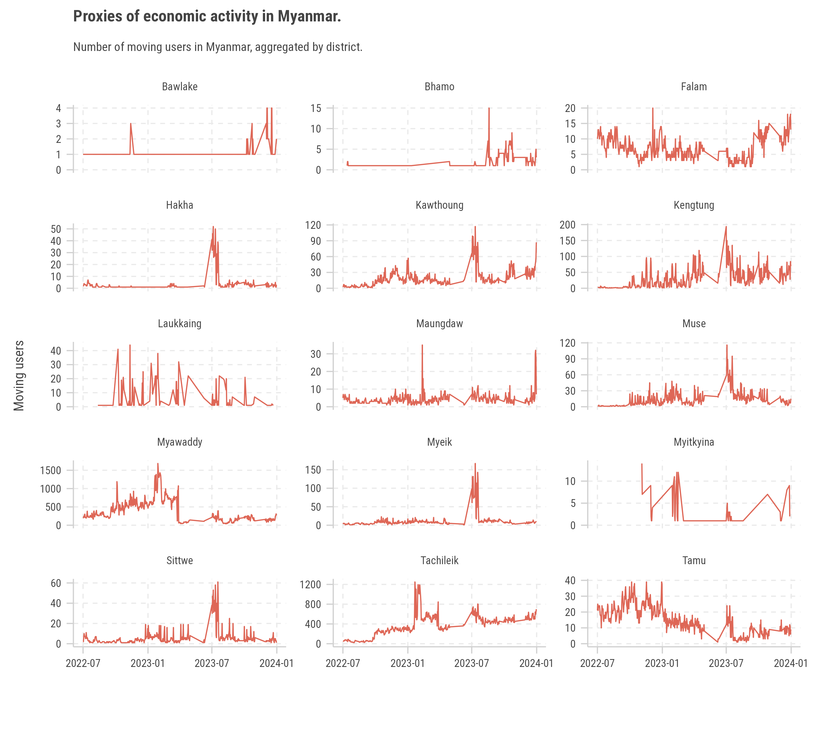
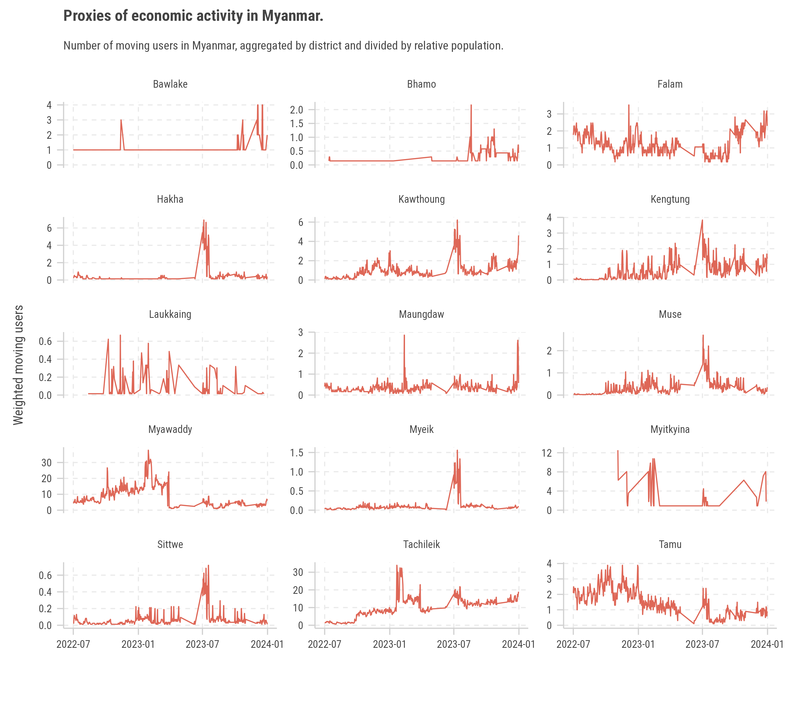
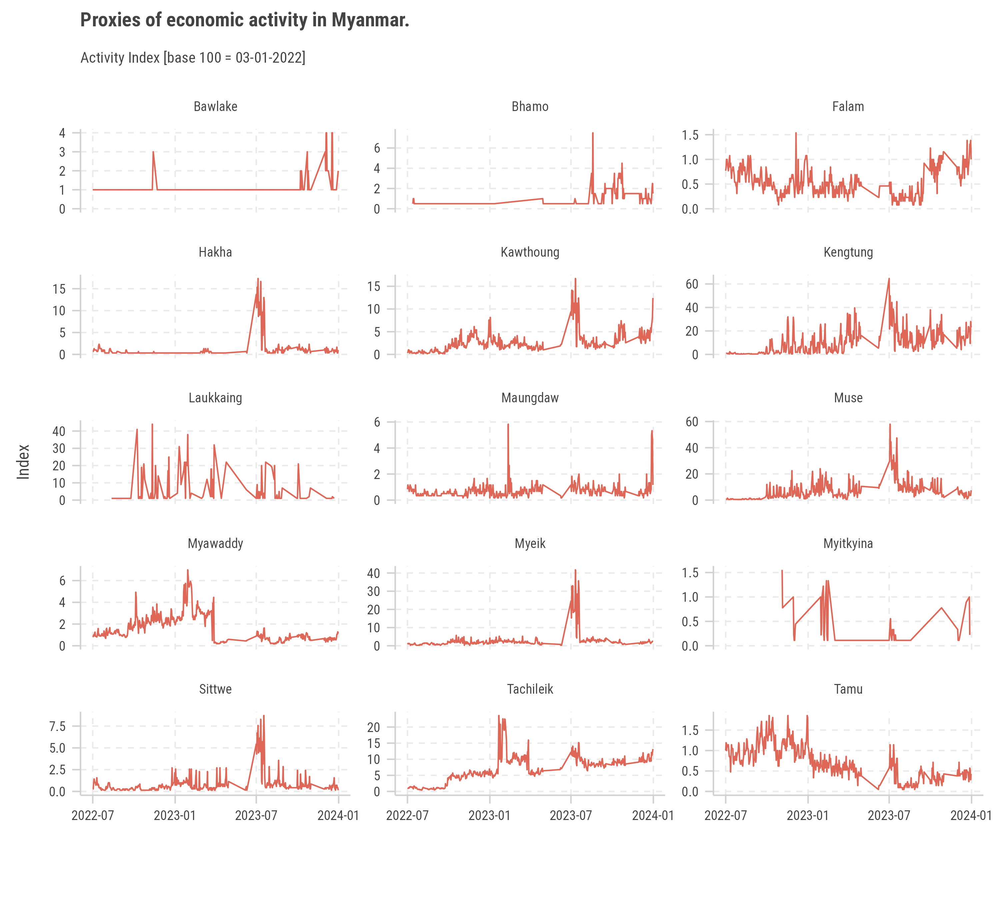
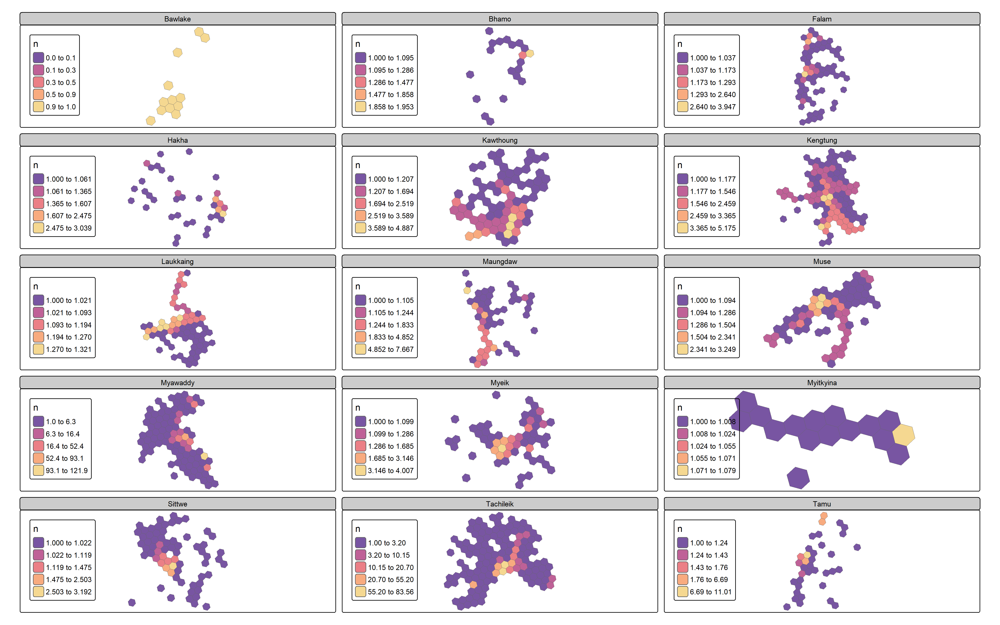
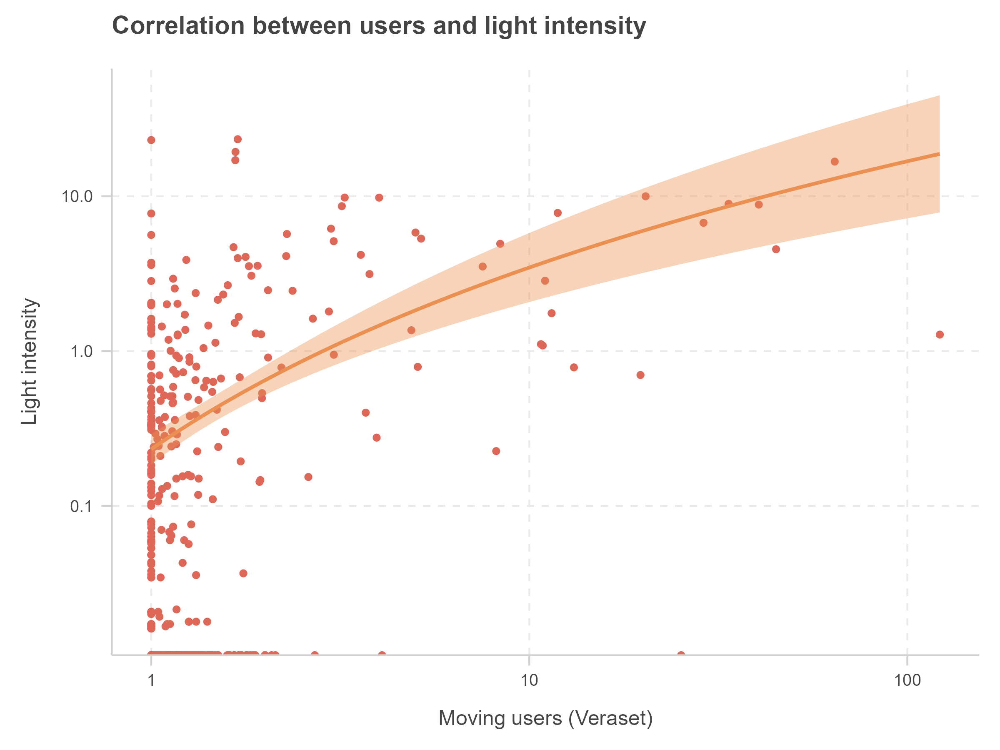
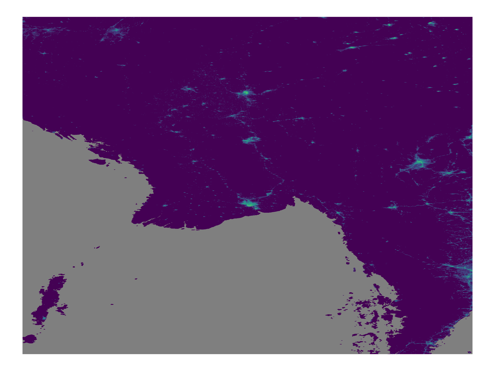

# Activity proxies in Myanmar
Development Data Partnership

# Introduction

In this document, an analysis of mobility and activity in different
strategic points in Myanmar will be conducted. For this purpose, the
Veraset database will be used, containing information on user mobility
in various parts of the world, obtained through the [Development Data
Partnership](https://datapartnership.org/) and the `blackmarbleR` R
package, [developed by the World
Bank](https://worldbank.github.io/blackmarbler/).

# Data Ingestion

The data is stored in an Amazon S3 Bucket, so an *Amazon SageMaker*
instance will be used for processing without the need for local
processing. The instance used has 128 GB of RAM.

To use the R programming language, the R kernel in Jupyter Notebook will
be used within a `conda` environment.

``` r
%%bash
conda update -n base -c defaults conda -y
conda create -n renv -c conda-forge python=3.8 r r-essentials r-tidyverse r-arrow -y
conda install -n renv openjdk -y
pip install jupyter
```

Once the environment is created, it will be activated and the Python
kernel will be switched to R.

``` r
%%bash --login
conda activate renv
```

# Data Processing

In this case, the `arrow` library will be used, which allows processing
large amounts of data efficiently regardless of the weight or partitions
of the database, in addition to having direct support with parquet
files.

``` r
library(arrow)
library(tidyverse)

path <- 's3://path-to-the-bucket/country=MM/*/*.parquet'

df <- open_dataset(path)

df <- df %>%
  mutate(datetime = from_utc_timestamp(datetime, tz = "UTC+6:30"),
         time_scope = if_else(
           hour(datetime) >= 7 & hour(datetime) < 19, "act",
           "home"))

valid_users <- df %>%
  count(hex_id, uid, date, time_scope) %>%
  filter(n_distinct(time_scope) == 2) %>%
  pull(uid) %>%
  unique() %>% collect()

df <- df %>%
  filter(uid %in% valid_users) %>%
  count(hex_id, uid, date) %>%
  ungroup() %>%
  count(hex_id, date) %>%
  collect()

write_csv(df, "index.csv")
```

In this processing, the data is loaded directly from the bucket and the
pipeline is processed without leaving the Arrow environment, just by
doing a `collect()` at the end of the chain. In this pipeline, a new
datetime is generated according to the time zone of Myanmar, and it is
classified whether the user is at home or in activity. If the mobile
device had records in both approaches, it will be considered valid, all
this taking as a reference each hexagon `H3` of resolution 7.

After processing the large amount of data that comes from the Veraset
database, the results can be processed by hexagon locally.

# Insights and visualizations

## Geospatial Approach

First, the geospatial structures on which spatial joins and different
merges will be based must be built. Thanks to the fact that the data
feed already has a column of hexagon IDs, the same units will be taken
in the insights and visualizations process.

Starting from points of interest in Myanmar, which are found in an Excel
file.

``` r
cities <- read_excel("coordinates.xlsx") %>% st_as_sf(coords = c("longitude", "latitude"), crs = 4326)

hexes <- cities %>% st_buffer(20000) %>%
  h3jsr::polygon_to_cells(res = 7) %>% enframe() %>%
  bind_cols(cities %>% st_drop_geometry()) %>%
  unnest(cols = "value") %>%
  rename(hex_id = value) %>%
  select(hex_id, district) %>%
  mutate(geometry = h3jsr::cell_to_polygon(hex_id)) %>% st_as_sf()
```

## Population

Then, a spatial join is performed between the hexagons and the
population of Myanmar, to be able to weigh the results of mobility based
on population density and have more precision on the number of users of
a city in terms relative to the others.

``` r
pop <- rast("MMR_ppp_v2c_2015_UNadj.tif")

pop_h <- terra::extract(pop, hexes, bind = TRUE, fun = sum, na.rm = TRUE) %>% st_as_sf() %>%
  rename(pop = 3)

wt <- pop_h %>% st_drop_geometry() %>% count(district, wt = pop) %>%
  mutate(wt = n/min(n))
```

## Spatial Join

Throughout the following different chunks, various left_joins will be
made to cross the information of the hexagons with the information of
users and population, as well as to have a basis for the subsequent
comparison with night lights images.

``` r
hexes %>%
 left_join(index) %>%
  group_by(date = as.Date(date), district) %>%
summarise(
  n = sum(n, na.rm = T)
) %>%
ggplot() +
  geom_line(aes(date, n)) +
  facet_wrap(~district, scales = "free_y", ncol = 3) +
  theme(text = element_text(family = "Roboto Condensed")) +
  labs(title = "Proxies of economic activity in Myanmar.", x = "", y = "Moving users",
       subtitle = "Number of moving users in Myanmar, aggregated by district.",
       caption = "Source: Veraset Movement Dataset")
```



For a more detailed view of the user distribution, two alternatives can
be taken:

1- **Calculation of population-weighted number of users**, dividing by
the relative population count.

2- **Base number calculation**, taking the number of unweighted users
relative to the first Monday of the year.

In the first case, the following results are obtained:

``` r
hexes %>%
  left_join(index) %>%
  group_by(date = as.Date(date), district) %>%
  summarise(
    n = sum(n, na.rm = T)
  ) %>% left_join(wt %>% select(1,3)) %>%
  mutate(n = n/wt) %>%
  ggplot() +
  geom_line(aes(date, n)) +
  facet_wrap(~district, scales = "free_y", ncol = 3) +
  theme(text = element_text(family = "Roboto Condensed")) +
  labs(title = "Proxies of economic activity in Myanmar.", x = "", y = "Weighted moving users",
       subtitle = "Number of moving users in Myanmar, aggregated by district and divided by relative population.",
       caption = "Source: Veraset Movement Dataset, WorldPop Population Density Raster")
```



And in terms of 100 base index = 2022-03-01:

``` r
hexes %>%
  left_join(index) %>%
  group_by(date = as.Date(date), district) %>%


  summarise(
    n = sum(n, na.rm = T)
  ) %>% group_by(district) %>%
  arrange(date) %>%
  mutate(n = n/n[3]) %>%
  ggplot() +
  geom_line(aes(date, n)) +
  facet_wrap(~district, scales = "free_y", ncol = 3) +
  theme(text = element_text(family = "Roboto Condensed")) +
  labs(title = "Proxies of economic activity in Myanmar.", x = "", y = "Index",
       subtitle = "Activity Index [base 100 = 03-01-2022]",
       caption = "Source: Veraset Movement Dataset")
```



## Spatial Analysis

In the next chunk, a spatial analysis of the number of users for each of
the points of interest is performed, for the average of the two years
analyzed. The `tmap` library is used.

``` r
library(tmap)

index  %>%
  group_by(hex_id) %>%
  summarise(n = mean(n, na.rm = T)) %>%
  left_join(hexes) %>%
  na.omit() %>%
  st_as_sf() %>%
 tm_shape() +
  tm_polygons( fill = "n", fill.scale = tm_scale_intervals(style = "kmeans",
                                                           values = "-carto.sunset"),
               fill.free = TRUE,
               fill.legend = tm_legend(position = tm_pos_auto_out("right", "center"))) +
  tm_facets("district", ncol = 3) -> tgrid
```



# Correlation with Night Lights

Finally, a correlation analysis is carried out between the number of
users and the intensity of light in the cities of interest. For this
purpose, the `blackmarbler` library will be used to obtain night lights
images from NASA, a library developed by the World Bank.

The `bm_raster` function allows obtaining NASA night lights images in
raster format for easy geospatial handling, and then an `extract` of
them is performed to obtain the light intensity in each of the hexagons
of interest, where the data of mobility and population had already been
processed.

``` r
library(blackmarbler)

bearer <- "NASA_BEARER_TOKEN"

r_2022 <- bm_raster(roi_sf = cities,
                    product_id = "VNP46A4",
                    date = 2022,
                    bearer = bearer)

lights <- terra::extract(rast(r_2022), index  %>%
  group_by(hex_id) %>%
  summarise(n = mean(n, na.rm = T)) %>%
  left_join(hexes) %>%
  na.omit() %>%
  st_as_sf(), fun = mean, bind = TRUE, method = "bilinear", na.rm = TRUE, ID = TRUE)  %>% st_as_sf() %>% rename(
  light = t2022
)

ggplot(lights, aes(n, light)) +
  geom_point() +
  scale_x_log10() +
  scale_y_log10() +
  geom_smooth(formula = y ~ log(x+1), method = "lm") +
  labs(x = "Moving users (Veraset)", y = "Light intensity",
       title = "Correlation between users and light intensity")

ggsave("plot_correlation.png", width = 8, height = 6, units = "in", dpi = 300)
```



And in night lights visualization mode:

``` r
ggplot(r_2022 %>% as.data.frame(xy = TRUE))+
  geom_raster(aes(x,y, fill = log(t2022+1))) +
  scale_fill_viridis_c("mako", name = "Intensity") +
  theme_void()
```



# Conclusions

In this document, an analysis of mobility and activity in different
strategic points in Myanmar has been carried out. The limited sample in
some cases prevents a deeper analysis, but a correlation between the
number of users and the light intensity in the cities of interest can be
observed, even when it comes to predictive models.
